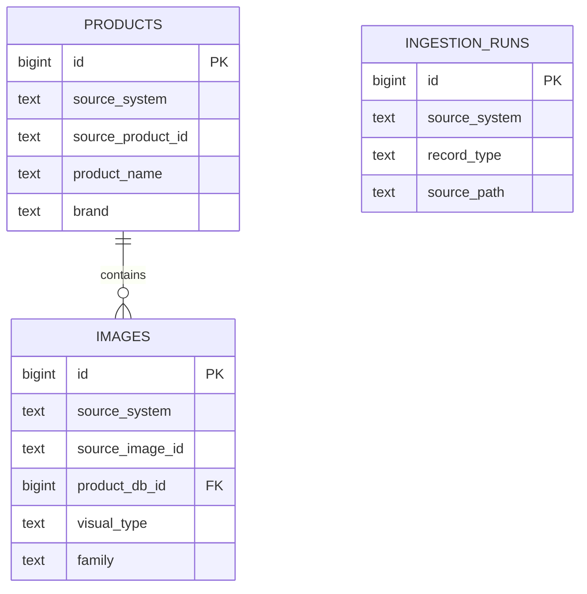

# PixelSeek Local PostgreSQL Schema

## Scope

Phase `1.5a` introduces a local PostgreSQL schema for the two JSON-backed data sources that currently power the app:

- `data/normalized-catalog.json`
- the live image index at the canonical PixelSeek path used by `src/utils.js`

The server still reads from JSON during `1.5a`. This schema and the migration scripts exist to prove the data can be loaded cleanly into Postgres before the `1.5b` server cutover.

## Database

- Local development database: `pixelseek_dev`
- PostgreSQL extension: `vector`

## Tables

### `products`

Product-level records from both source systems.

Key columns:

- `source_system`
  - `normalized_catalog`
  - `image_index`
- `source_product_id`
- `product_name`
- `brand`
- `description`
- `raw_category`
- `a_level`, `b_level`, `c_level` (`text[]`)
- `product_image_url`
- `website`
- `source_file`
- `image_urls` (`text[]`)
- `product_metadata` (`jsonb`)
- `raw_payload` (`jsonb`)

Identity:

- surrogate primary key: `id`
- source-level uniqueness: `(source_system, source_product_id)`

Why source-aware instead of a single natural key:

- the historical local browse catalog and the live image index do not currently share the same product ID namespace
- `1.5a` preserves both cleanly without forcing an early merge heuristic

### `images`

Image-level records from both source systems.

Key columns:

- `source_system`
- `source_image_id`
- `product_db_id` -> `products.id`
- `source_product_id`
- `image_url`
- `product_name`
- `brand`
- `a_level`, `b_level`, `c_level` (`text[]`)
- `category`
- `visual_type`
- `family`
- `seating_type`
- `pixelseek_type`
- `type_routing_source`
- `stage_0_result`
- `stage_1_override` (`jsonb`)
- `stage_1_override_result`
- `stage_1_override_reason`
- `effective_classification`
- `enum_fields` (`jsonb`)
- `field_confidence` (`jsonb`)
- `free_text` (`jsonb`)
- `image_traits` (`jsonb`)
- `stage1`, `stage2`, `stage3` (`jsonb`)
- `visual_summary`
- `structured_caption`
- `search_text`
- `visual_summary_embedding` (`vector(1536)`)
- `search_text_embedding` (`vector(1536)`)
- `image_width`, `image_height`, `image_short_side`
- `ai_refreshed_at`
- `is_catalog_primary_image`
- `image_metadata` (`jsonb`)
- `raw_payload` (`jsonb`)

Identity:

- surrogate primary key: `id`
- source-level uniqueness: `(source_system, source_image_id)`

### `ingestion_runs`

Simple audit table for re-runnable imports.

Tracks:

- source system
- record type
- source path
- record count
- notes (`jsonb`)
- timestamps

## Indexes

### B-tree

- product lookups by brand, name, raw category, source file
- image lookups by product, visual type, family, classification, primary-image flag

### GIN

- category arrays on `products` and `images`
- flexible payload blobs such as:
  - `product_metadata`
  - `raw_payload`
  - `enum_fields`
  - `image_traits`
  - `stage1`
  - `stage2`
  - `stage3`

### Vector indexing

No ANN index is created in `1.5a`.

The vector columns are present now so data can be loaded and verified. Approximate nearest-neighbor indexes such as HNSW will be added in `1.5c`.

## Migration scripts

### `scripts/setup-postgres-dev.js`

- creates `pixelseek_dev` if needed
- enables `vector`
- applies `db/pixelseek-dev-schema.sql`

### `scripts/migrate-normalized-catalog-to-postgres.js`

- loads `data/normalized-catalog.json`
- upserts `products`
- upserts catalog `images`
- marks `is_catalog_primary_image` when an image matches the product’s `product_image`

### `scripts/migrate-image-index-to-postgres.js`

- loads the canonical live image index path from `src/utils.js`
- upserts source-aware `products`
- upserts extracted `images`
- stores embeddings in `vector(1536)`
- stores extracted trait/state payloads in `jsonb`

### `scripts/merge-canonical.js`

- rebuilds the canonical product/image layer from the two source-aware tables
- primary product match: trailing numeric Designer Pages ID
- fallback product match: exact `brand + product_name` only when uniquely unclaimed
- primary image match: exact `image_url`
- preserves source provenance in link tables

## Stage 1.5b read-path note

The `1.5b` read-path migration uses PostgreSQL as the source of truth for:

- bootstrap metadata
- browse mode
- text search
- refine-search

Search uses `pgvector` for brute-force candidate retrieval from `canonical_images` and then keeps the existing JavaScript-side result shaping and reranking behavior on the returned candidate set.

The write/update flows still remain JSON-backed during `1.5b`, including:

- product refresh
- bulk refresh
- eval writebacks
- extraction-summary style tooling tied to the JSON index

## Relationships

